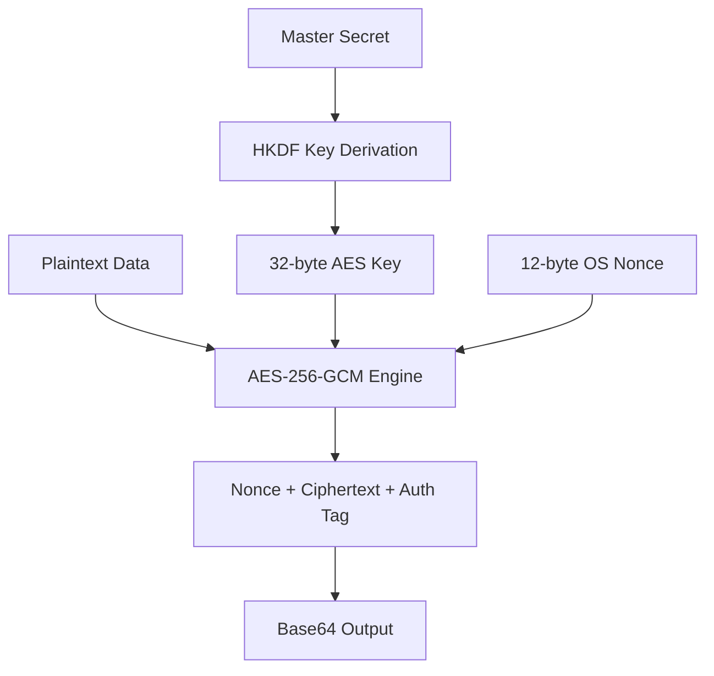
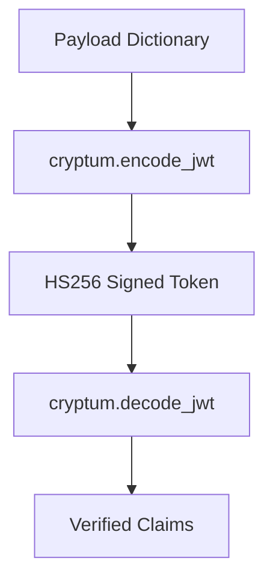

# Cryptum

**Boring, Explicit, and Auditable Security for Humans.**

Welcome to **Cryptum**. I built this library because I was tired of seeing developers struggle with cryptographic "foot guns." Security shouldn't be a guessing game of choosing the right algorithm or parameter. I wanted a library that follows the "boring" path: conservative, industry-standard, and designed to be difficult to misuse.

---

## My Philosophy: Why I Chose and What I Chose

I didn't choose these algorithms by accident. Every piece of `cryptum` is designed to solve a specific security challenge with the most robust tool available.

### 1. Argon2id (for Passwords)
I chose **Argon2id** (via `argon2-cffi`) as my primary hashing algorithm for secrets like passwords. 
*   **Why?** It is the winner of the Password Hashing Competition. It’s resistant to GPU-based cracking and side-channel timing attacks. 
*   **My Config:** I use 64MB of memory, 3 iterations, and 2 threads. It's built to be "slow" enough to kill crackers but "fast" enough for a modern web app.

### 2. HMAC-SHA256 (for API Keys)
For API tokens (`ak_...`), I chose **HMAC-SHA256**.
*   **Why?** API keys need to be verified instantly at the edge. By returning a `plaintext` key and a `signature`, I allow the server to verify authenticity without necessarily hitting a database every time. HMAC ensures the key hasn't been tampered with and was indeed issued by me.

### 3. AES-256-GCM (for Webhook Secrets)
Webhook secrets are tricky. I chose **AES-256-GCM** (via `cryptography`) to store them.
*   **Why?** Unlike passwords, you actually *need* the secret back in plaintext to sign outgoing webhook payloads. If I hashed them, I couldn't use them. 
*   **Security:** By encrypting them at rest, if your database is leaked, the secrets are useless without the master `encryption_secret`. I chose **GCM** because it provides "authenticated encryption" and it detects if someone has tampered with the encrypted data.

### 4. Fast SHA-256 (for OTPs & Backup Codes)
For 6-digit OTPs and 16-character backup codes, I chose standard **SHA-256**.
*   **Why?** Speed. These secrets are extremely short-lived (OTPs) or used only once (Backup Codes). Using a heavy algorithm like Argon2 for a 6 digit number is overkill and can be a DoS vector. SHA-256 provides the perfect balance of security and throughput for these specific use cases.

### 5. The "Enterprise Suite" of Specialized Keys
Every enterprise-grade system needs specialized tracking and safety keys. I built a variety of unique key generators because using a generic UUID for everything is a missed opportunity for observability and security.

*   **Enterprise-Ready Identifier Suite**: I replaced generic UUIDs with specialized, high-entropy keys designed for real-world reliability; from hashed **Idempotency Keys** (`idemk_`) for safe retries and **Trace Keys** (`trk_`) for observability, to **Classification Keys** (`clk_`) with embedded sensitivity levels, and dedicated trackers for deduplication, sessions, and fingerprinting.

---

## Dependency Mapping

| Target | Library Used | Algorithm |
| :--- | :--- | :--- |
| **Passwords** | `argon2-cffi` | Argon2id |
| **Encryption** | `cryptography` | AES-256-GCM + HKDF |
| **JWTs** | `PyJWT` | HS256 (Hardcoded) |
| **Entropy** | `secrets` | OS-native CSPRNG |

---

## System Diagrams

### AES-256-GCM Encryption Flow
I use **HKDF** to derive a unique key from your master secret, ensuring that even if you use a weak master password, the resulting encryption key is cryptographically strong.



### JWT Security Flow
I've simplified JWTs to be "Secure by Default". Algorithm confusion is prevented by hardcoding `HS256`, and timestamps (`iat`/`exp`) are mandatory.



---

## 💎 What to Expect (Example Formats)

I built this library so you never have to guess what a value should look like. Every single token and key has a distinct, descriptive prefix for perfect observability in your logs and database.

### 🎭 Tokens (The Authentication Layer)
*   **API Keys**: `ak_1A2b3C4d5E...` (High-entropy, HMAC-signed)
*   **Refresh Tokens**: `rt_ZyX987WvUt...` (Long-lived auth state)
*   **Session Tokens**: `sess_HjK89Lp0...` (Ephemeral user sessions)
*   **Webhook Secrets**: `whs_QwErTy123...` (Encrypted at rest)
*   **JWT Tokens**: `eyJhbGciOiJIUzI1Ni...` (Standard vertical-stack JWT)
*   **CSRF Tokens**: `csrf_AbCdEf123...` (Form submission safety)
*   **One-Time Nonces**: `n_7890abcdef...` (Replay protection)
*   **Email & Reset Tokens**: `ev_...` (Verify) / `pr_...` (Password Reset)
*   **Magic Links**: `ml_...` (Passwordless entry)
*   **Sudo & 2FA Sessions**: `sudo_...` / `tfas_...` (Elevated privilege states)

### 🔑 Keys (The Enterprise Safety Layer)
*   **Idempotency Keys**: `idemk_3n8G9pLk1...` (Perfect for API retries)
*   **Trace Keys**: `trk_0pLmN9bV8...` (Cross-service request tracing)
*   **Classification Keys**: `clk_01abcd...` (Prefix `01`/`02`/`03` mirrors data sensitivity)
*   **Deduplication Keys**: `dk_...` (Prevent double-processing events)
*   **Fingerprint Keys**: `fk_...` (Unique device/browser identity)
*   **Session-Storage Keys**: `ssk_...` (Fast internal session mapping)
*   **Failure Keys**: `flk_...` (Unique identifier for error snapshots)
*   **Time & Confirmation**: `tk_...` / `ck_...` (Ordered states and confirmations)

---

## Usage & API Mapping

I have flattened the API into the top level `cryptum` namespace. You don't need to dig through submodules; just import and go.

### Full API Reference

#### 🛡️ Cryptographic Operations
| Function | Description |
| :--- | :--- |
| `cryptum.encrypt(data, key, context?)` | Advanced AES-256-GCM authenticated encryption. |
| `cryptum.decrypt(blob, key, context?)` | Decrypts GCM blobs back to plaintext string. |
| `cryptum.argon2id_hash(secret)` | Secure Argon2id hashing for any secret. |
| `cryptum.argon2id_verify(secret, hash)` | Verify secret against Argon2id hash. |
| `cryptum.hmac_sign(data, key)` | Generate HMAC-SHA256 signature. |
| `cryptum.hmac_verify(data, key, sig)` | Timing-safe HMAC verification. |
| `cryptum.sha256_hash(data)` | Fast SHA-256 hashing for short-lived data. |
| `cryptum.sha256_verify(data, hash)` | Verify SHA-256 hashes. |

#### 🎟️ Token Generation
| Function | Job |
| :--- | :--- |
| `cryptum.generate_api_key(key)` | Signed API key generation. |
| `cryptum.encode_jwt(payload, key)` | Secure-by-default HS256 JWT encoding. |
| `cryptum.decode_jwt(token, key)` | JWT decoding with mandatory expiry verification. |
| `cryptum.generate_csrf_token()` | High-entropy CSRF protection. |
| `cryptum.generate_session_token()` | Secure session identifier. |
| `cryptum.generate_refresh_token()` | Long-lived refresh token. |
| `cryptum.generate_magic_link()` | One-time magic link token. |
| `cryptum.generate_email_verification()` | Secure email verification code. |
| `cryptum.generate_password_reset()` | Password reset token. |
| `cryptum.generate_reauth_token()` | Re-authentication verification token. |
| `cryptum.generate_sudo_session()` | Elevated privilege session token. |
| `cryptum.generate_twofa_session()` | 2FA verification session token. |
| `cryptum.generate_nonce()` | Cryptographic nonce for replay protection. |
| `cryptum.generate_webhook_secret(key)` | Encrypted-at-rest webhook secret. |

#### 🔑 Specialized Enterprise Keys
| Function | Job |
| :--- | :--- |
| `cryptum.generate_idempotency_key()` | Safe API retry protection (`idemk_`). |
| `cryptum.generate_trace_key()` | Global request tracing identifier (`trk_`). |
| `cryptum.generate_classification_key()` | Key with embedded data sensitivity (`clk_`). |
| `cryptum.generate_confirmation_key()` | Transition confirmation key. |
| `cryptum.generate_deduplication_key()` | Prevent duplicate event processing. |
| `cryptum.generate_failure_key()` | Unique error state identifier. |
| `cryptum.generate_fingerprint_key()` | Device/client identity tracking. |
| `cryptum.generate_session_key()` | High-performance session mapping key. |
| `cryptum.generate_time_key()` | Time-stamped secure identifier. |

#### ⚙️ Core & Entropy
| Function | Description |
| :--- | :--- |
| `cryptum.random_string(length, chars?)` | Generate secure random strings. |
| `cryptum.hex_entropy(bytes)` | Raw hex entropy generation. |
| `cryptum.urlsafe_entropy(bytes)` | URL-safe Base64 entropy. |
| `cryptum.bytes_entropy(bytes)` | Raw secure random bytes. |
| `cryptum.with_prefix(prefix, val)` | Standardized prefixing for observability. |
| `cryptum.timing_safe_equals(a, b)` | Constant-time equality for secrets. |

You don’t need most of this. Use what fits your system.
---

### A Quick Example
Here is how I envision you using this in a real app:

```python
import cryptum

# 1. Securely encrypt a sensitive field
secret_key = "my-super-secret-master-key"
encrypted_blob = cryptum.encrypt("sensitive user data", secret_key)

# 2. Generate an idempotency key for an API call
idem_key = cryptum.generate_idempotency_key()
# { "plaintext": "idemk_...", "hash": "..." }

# 3. Create a JWT with mandatory expiry
token = cryptum.encode_jwt({"user_id": 123}, secret_key, expiry_seconds=3600)

# 4. Hash a secret with Argon2id
argon2_hash = cryptum.argon2id_hash("my-secret-data")
```

---

## Visual System Layout

```text
    [ USER APP ] 
         |
    [ CRYPTUM API ] <--- Flattened & Simple
         |
    +------------------------------------------+
    |         |               |                |
 [CRYPTO]  [TOKENS]        [KEYS]          [CORE]
    |         |               |                |
 Argon2id   HMAC-256    Idempotency (idemk_)  CSPRNG
 AES-GCM    JWT-HS256   Trace (trk_)          Entropy
 SHA-256    CSRF/Magic  Classification (clk_) Utils
```

```text
    [ ENCRYPTION ARCHITECTURE ]
    
    (Key) -----> [ HKDF ] -----> (Derived Key)
                                      |
                                      v
    (Data) + (Nonce) -----------> [AES-GCM] ---------> [BASE64 BLOB]
```

---

## Security Notice
I've designed this to be as safe as possible, but cryptography relies on your secrets staying secret. Never commit your master keys to version control.

**Built with ❤️ and extreme paranoia by Cryptum Developers.**
